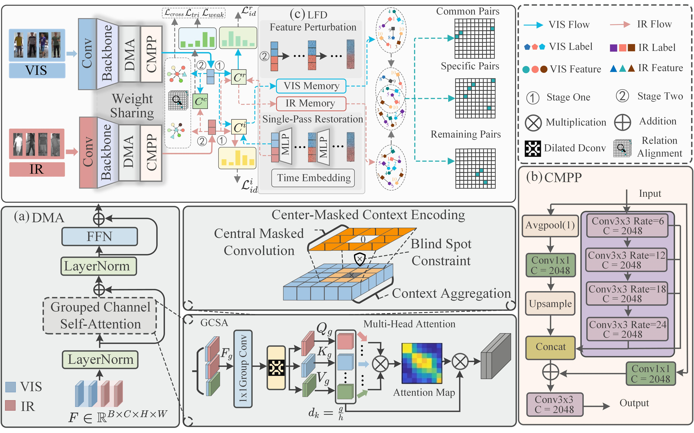

# CM2FD

<div align="center">

# Center-Masked Context Modeling and Feature Denoising for Weakly-Supervised Visible-Infrared Person Re-Identification

**CM2FD** · PyTorch Implementation

[](https://www.python.org/)
[](https://pytorch.org/)
[](https://developer.nvidia.com/cuda-toolkit)
[](#license)

</div>

> Official project repository for **Center-Masked Context Modeling and Feature Denoising for Weakly-Supervised Visible-Infrared Person Re-Identification**.  
> The repository is under active development. Paper link, pretrained models, complete benchmark results, and citation information will be released when available.

---

## Contents

- [Overview](#overview)
- [Framework](#framework)
- [Method Highlights](#method-highlights)
- [Repository Structure](#repository-structure)
- [Environment](#environment)
- [Datasets](#datasets)
- [Data Preparation](#data-preparation)
- [Training](#training)
- [Evaluation](#evaluation)
- [Important Implementation Notes](#important-implementation-notes)
- [Results](#results)
- [Reproducibility Checklist](#reproducibility-checklist)
- [Acknowledgements](#acknowledgements)
- [Citation](#citation)
- [License](#license)
- [Contact](#contact)

---

## Overview

Visible-Infrared Person Re-Identification (VI-ReID) aims to retrieve the same pedestrian across visible (VIS/RGB) and infrared (IR) cameras. The task is challenging because of the large cross-modality discrepancy between visible and thermal imagery.

The weakly-supervised setting is more difficult: identity supervision is available within each modality, while direct cross-modality identity correspondence is unavailable or incomplete. As a result, the model must discover reliable cross-modality relationships while suppressing noisy or uncertain associations.

**CM2FD** is designed around two complementary objectives:

1. **Center-Masked Context Modeling** — strengthen contextual representation while reducing excessive dependence on the most dominant local response.
2. **Feature Denoising** — progressively improve unreliable cross-modality feature correspondences and reduce the influence of noisy matching relationships.

The implementation uses a two-stage optimization strategy and supports the commonly used **SYSU-MM01**, **RegDB**, and **LLCM** benchmarks.

---

## Framework

<p align="center">
  
</p>

**Figure 1. Overall framework of CM2FD.**

The framework contains visible and infrared streams with shared representation learning. The architecture combines context-aware feature enhancement, cross-modality relationship modeling, and feature denoising. During training, the method progressively establishes cross-modality correspondences and separates reliable common pairs, modality-specific pairs, and remaining uncertain pairs.

The major components shown in the framework include:

- **DMA**: feature interaction / attention module for strengthening modality-aware representation.
- **Center-Masked Context Encoding**: masks the central response of a convolutional receptive field and aggregates surrounding context, encouraging the network to exploit complementary spatial evidence.
- **GCSA**: grouped channel self-attention for modeling long-range dependencies among feature groups.
- **CMPP**: multi-scale context aggregation using parallel dilated convolutions and global pooling.
- **LFD**: latent/feature denoising branch with feature perturbation, modality memory, and restoration-based learning.
- **Cross-modality pair partitioning**: dynamically organizes discovered relations into common, specific, and remaining pairs for subsequent optimization.

> The exact mathematical definitions, loss terms, and training schedule should be referred to the paper once the manuscript is publicly available.

---

## Method Highlights

### 1. Weakly-Supervised Cross-Modality Learning

CM2FD does not rely on fully paired VIS-IR identity annotations during cross-modality optimization. Instead, it learns intra-modality discriminative representations first and then progressively discovers cross-modality relationships.

### 2. Center-Masked Context Modeling

Conventional local convolution may over-focus on the strongest central response. CM2FD introduces a center-masked context mechanism that suppresses the center location of the receptive field and forces the network to aggregate surrounding contextual cues.

This design aims to:

- improve robustness to local appearance noise;
- encourage spatially complementary representations;
- reduce over-reliance on a single discriminative region;
- improve modality-invariant feature learning.

### 3. Multi-Scale Context Aggregation

The CMPP branch combines global pooling and multiple dilated-convolution paths. Different dilation rates provide complementary receptive fields so that both local details and larger contextual patterns can be incorporated.

### 4. Feature Denoising

The denoising branch operates on extracted VIS/IR features and memory representations. It introduces feature perturbation and restoration to improve feature robustness and reduce the negative effect of noisy cross-modality correspondences.

### 5. Progressive Pair Mining

Cross-modality relations are not treated uniformly. During optimization, candidate relations are dynamically divided into several categories, including reliable/common pairs, specific pairs, and unresolved/remaining pairs. Different supervision strengths can then be applied according to pair reliability.

### 6. Two-Stage Training

The current implementation follows a two-stage pipeline:

- **Stage 1:** learn strong modality-specific / intra-modality representations.
- **Stage 2:** perform weakly-supervised cross-modality learning, relation mining, feature denoising, and progressive refinement.

---

## Repository Structure

The public repository currently contains the following main entry files:

```text
ICASSP2027-CM2FD/
├── datasets/               # Dataset package / data loading components
├── log/                    # Training logs and saved experiments
├── Figure2.jpg             # Framework figure
├── main.py                 # Main training / evaluation entry
├── pre_process_sysu.py     # SYSU-MM01 preprocessing
├── wsls.py                 # Cross-modality matching / CMA-related implementation
├── utils.py                # Utility functions
├── requirements.txt        # Environment dependencies
├── sysu.sh                 # SYSU-MM01 example command
├── regdb.sh                # RegDB example command
├── run.sh                  # SLURM example
└── ...
```

Some internal modules imported by `main.py` (for example `models`, `task`, and dataset factory components) must be available in the working project before training. If you clone the repository and these modules are absent, please check the latest branch/commit.

---

## Environment

### Recommended Setup

The repository currently targets **PyTorch 2.0.1 + CUDA 11.8**.

A clean Conda environment is recommended:

```bash
conda create -n cm2fd python=3.10 -y
conda activate cm2fd
```

Install PyTorch:

```bash
pip install torch==2.0.1 torchvision==0.15.2 torchaudio==2.0.2 \
  --index-url https://download.pytorch.org/whl/cu118
```

Install the remaining dependencies:

```bash
pip install setproctitle==1.3.3 tqdm==4.65.0
pip install scikit-learn numpy pillow
```

Alternatively:

```bash
pip install -r requirements.txt
```

> **Note:** the current `requirements.txt` records `python==3.12` together with PyTorch 2.0.1. For reproducibility, Python 3.10/3.11 is recommended with the PyTorch 2.0.1 CUDA 11.8 stack.

### Clone

```bash
git clone https://github.com/Deandary/ICASSP2027-CM2FD.git
cd ICASSP2027-CM2FD
```

---

## Datasets

CM2FD supports three standard VI-ReID benchmarks.

### SYSU-MM01

SYSU-MM01 contains visible and infrared images captured by multiple cameras and is commonly evaluated under:

- **All-search**
- **Indoor-search**
- **Single-shot / Multi-shot** gallery settings

Dataset information:  
https://github.com/wuancong/SYSU-MM01


### LLCM

LLCM is a low-light cross-modality person ReID benchmark containing visible and near-infrared images.

Dataset information:  
https://github.com/ZYK100/LLCM

---

## Data Preparation

A recommended data layout is:

```text
<DATA_ROOT>/
├── SYSU-MM01/
│   ├── cam1/
│   ├── cam2/
│   ├── cam3/
│   ├── cam4/
│   ├── cam5/
│   ├── cam6/
│   └── exp/
└── LLCM/
    ├── idx/
    ├── vis/
    ├── nir/
    ├── test_vis/
    └── test_nir/
```

### SYSU-MM01 Preprocessing

Run:

```bash
python pre_process_sysu.py
```

The preprocessing script converts the SYSU-MM01 training data into the format expected by the dataloader.

Before running the code, make sure the dataset root in the preprocessing script or command-line configuration points to your local dataset location.

### Configure Dataset Root

`main.py` exposes:

```bash
--data-path
```

Example:

```bash
python main.py \
  --dataset sysu \
  --data-path /path/to/datasets/
```

---

## Training

### Important

The current `main.py` defaults to:

```text
--mode test
```

Therefore, **explicitly add `--mode train` when training**.

### SYSU-MM01

Example:

```bash
python main.py \
  --dataset sysu \
  --mode train \
  --debug wsl \
  --save-path sysu_cm2fd \
  --arch cssp \
  --stage1-epoch 20 \
  --stage2-epoch 150 \
  --milestones 30 70 \
  --lr 0.0003 \
  --device 0
```

Or use the provided script after verifying its arguments:

```bash
bash sysu.sh
```


A complete RegDB experiment should repeat the experiment across the required trials and report the averaged result according to the standard protocol.

### LLCM

Example:

```bash
python main.py \
  --dataset llcm \
  --mode train \
  --debug wsl \
  --save-path llcm_cm2fd \
  --arch cssp \
  --stage1-epoch 80 \
  --stage2-epoch 150 \
  --milestones 30 70 \
  --lr 0.0003 \
  --device 0
```


## Evaluation

The implementation reports the standard person ReID metrics:

- **CMC / Rank-k**
  - Rank-1
  - Rank-10
  - Rank-20
- **mAP** — mean Average Precision
- **mINP** — mean Inverse Negative Penalty

### SYSU-MM01

```bash
python main.py \
  --dataset sysu \
  --mode test \
  --arch cssp \
  --search-mode all \
  --gall-mode single \
  --model-path /path/to/checkpoint \
  --device 0
```

For indoor-search:

```bash
python main.py \
  --dataset sysu \
  --mode test \
  --arch cssp \
  --search-mode indoor \
  --gall-mode single \
  --model-path /path/to/checkpoint \
  --device 0
```


### LLCM

```bash
python main.py \
  --dataset llcm \
  --mode test \
  --arch cssp \
  --test-mode t2v \
  --model-path /path/to/checkpoint \
  --device 0
```

---

## Important Implementation Notes

Please check the following before reproducing experiments.

### 1. `--milestones` vs. `--milestone`

`main.py` defines:

```text
--milestones
```

Some existing shell scripts use `--milestone`. Use the plural argument unless the parser is changed.

### 2. Training mode must be explicitly enabled

The parser currently uses:

```text
--mode test
```

as the default. Add:

```bash
--mode train
```

for training jobs.

### 3. CUDA device configuration

`main.py` currently contains a hard-coded CUDA environment setting, and `wsls.py` initializes the CMA memory module on a fixed CUDA device. If your machine uses a different GPU layout, update the device configuration before training.

A cleaner implementation is to consistently use the command-line `--device` value throughout all modules.

### 4. SLURM paths

`run.sh` contains cluster-specific values such as:

- partition name;
- node name;
- Conda environment;
- absolute working directory.

Replace these with settings from your own cluster.

### 5. Checkpoint directory

The main script writes logs and model checkpoints under the experiment save directory. Keep each dataset/trial in a separate folder to avoid accidental overwrite.

---


## License

A license has not yet been specified in the public repository.

Before redistribution or commercial use, please add an explicit open-source license (for example, MIT, Apache-2.0, or another license compatible with all upstream code and datasets).

Dataset licenses and usage agreements are controlled by the respective dataset owners.

---

## Contact

For questions, please open a GitHub issue in this repository:

https://github.com/Deandary/ICASSP2027-CM2FD/issues

Project page:

https://github.com/Deandary/ICASSP2027-CM2FD
